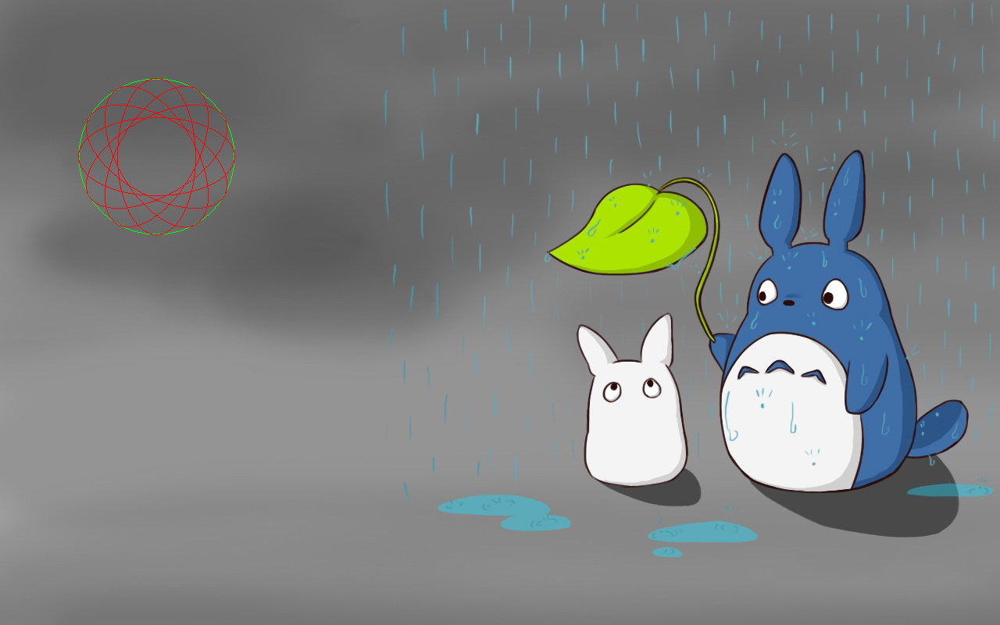

# 基本图形的绘制
## 画线
api
```python
def line(img, pt1, pt2, color, ...):
    """
    画线
    :param img: 在那个图像上画线
    :param pt1: 起点
    :param pt2: 终点
    :param color: 颜色
    :param thicknes: 线宽
    :param lineType: 线型(-1,4,8,16)
    :param shift: 坐标缩放比例
    """
```
example
```python
# part3 画线
import cv2

if __name__ == '__main__':
    img = cv2.imread(r'../../../image/test.png')
    # pt -> (x, y)
    # color -> (b, g, r)
    cv2.line(img, (10, 10), (100, 10), (0, 0, 255), thickness=2)
    cv2.line(img, (10, 10), (10, 100), (0, 0, 255), thickness=2)
    cv2.line(img, (10, 100), (100, 100), (0, 0, 255), thickness=2)
    cv2.line(img, (100, 10), (100, 100), (0, 0, 255), thickness=2)

    cv2.imshow('line', img)

    cv2.waitKey(0)
```
## 画椭圆
api
```python
def ellipse(img, center, axes, angle, startAngle, endAngle, ...):
    """
    绘制椭圆
    :param img: 在那个图像上画
    :param center: 中心点
    :param axes: 长宽的一半
    :param angle: 角度 -> 顺时针
    :param startAngle: 从哪个角度开始 
    :param endAngle: 到哪个角度结束
    :param color: 颜色
    :param thickness: 线宽
    :param lineType: 线型(-1,4,8,16)
    :param shift: 坐标缩放比例
    """
```
example
```python
# part3 画椭圆
import cv2

if __name__ == '__main__':
    img = cv2.imread(r'../../../image/test.png')
    # 圆
    cv2.circle(img, (200, 200), 100, (0, 255, 0))
    # 椭圆
    cv2.ellipse(img, (200, 200), (100, 50), 0, 0, 360, (0, 0, 255))
    cv2.ellipse(img, (200, 200), (100, 50), 30, 0, 360, (0, 0, 255))
    cv2.ellipse(img, (200, 200), (100, 50), 60, 0, 360, (0, 0, 255))
    cv2.ellipse(img, (200, 200), (100, 50), 90, 0, 360, (0, 0, 255))
    cv2.ellipse(img, (200, 200), (100, 50), 120, 0, 360, (0, 0, 255))
    cv2.ellipse(img, (200, 200), (100, 50), 150, 0, 360, (0, 0, 255))
    cv2.ellipse(img, (200, 200), (100, 50), 180, 0, 360, (0, 0, 255))

    cv2.imshow('ellipse', img)

    cv2.waitKey(0)

```


## 多边形
api
```python
def polylines(img, pts, isClosed, color, ...):
    """
    多边形绘制
    :param img: 在那个图像上画
    :param pts: 点集
    :param isClosed: 是否闭环
    :param color: 颜色
    :param thickness: 线宽
    :param lineType: 线型(-1,4,8,16)
    :param shift: 坐标缩放比例
    """
```
example
```python
# part3 多边形

import cv2
import numpy as np

if __name__ == '__main__':
    img = cv2.imread(r'../../../image/test.png')
    
    # 多边形
    pts = np.array([(300, 10), (150, 100), (450, 100)], dtype=np.int32)
    cv2.polylines(img, [pts], isClosed=True, color=(0, 0, 255))

    # 填充
    cv2.fillPoly(img, [pts], (0, 255, 0))

    cv2.imshow('polyline', img)
    cv2.waitKey(0)

```
## 文本
api
```python
def putText(img: Any,
            text: Any, # 文本
            org: Any, # 起始位置
            fontFace: Any, # 字体
            fontScale: Any, # 字号
            color: Any, # 颜色
            thickness: Any = None,
            lineType: Any = None)
```
example
```python
import cv2

if __name__ == '__main__':
    img = cv2.imread(r'../../../image/test.png')
    cv2.putText(img, 'hello world!', (10, 400), cv2.FONT_HERSHEY_PLAIN, 1, (255, 0, 0))
    cv2.imshow('polyline', img)
    cv2.waitKey(0)


```